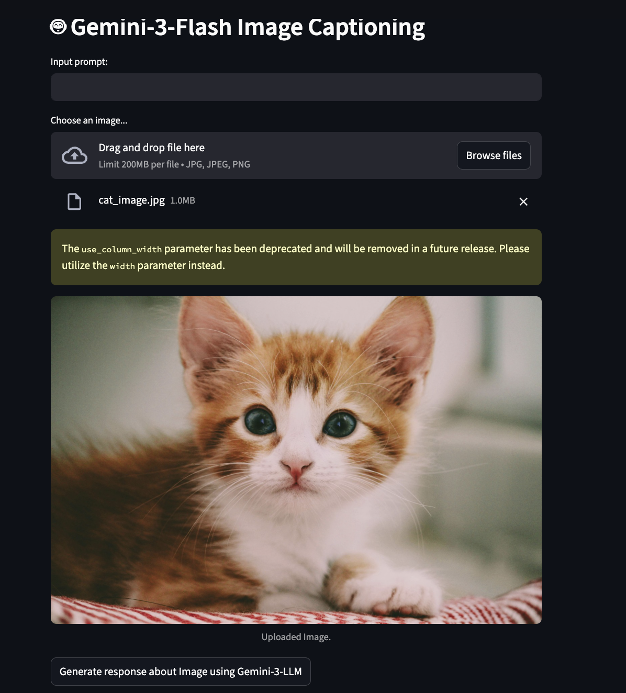

# 🤖 Gemini-3-Flash Image Captioning

A Streamlit web app that uses Google's Gemini-3-Flash model to analyze
and caption images using AI.

## 🚀 Features

- Upload any image and get AI-generated captions
- Optional custom prompt input
- Powered by Google Gemini-3-Flash

## 🛠️ Tech Stack

- Python
- Streamlit
- Google Generative AI (Gemini)

## ⚙️ Setup & Installation

1. Clone the repository
   git clone https://github.com/YOUR_USERNAME/GEMINI-3.git
   cd GEMINI-3
2. Install dependencies
   pip install -r requirements.txt
3. Create a .env file and add your API key
   GEMINI_API_KEY=your_gemini_api_key_here
4. Run the app
   streamlit run app.py

## 🔑 Get API Key

Get your free Gemini API key at: https://aistudio.google.com

## 📸 Demo

